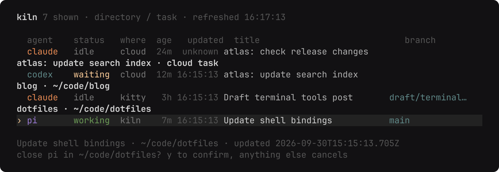
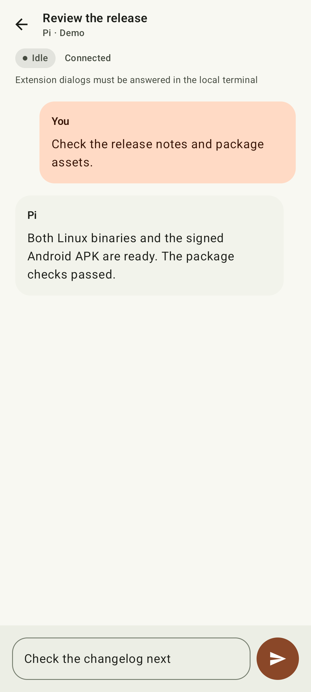
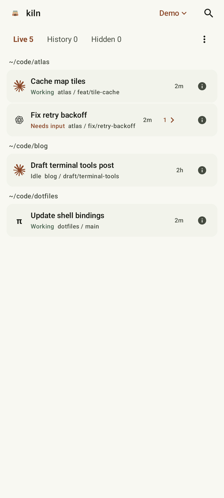
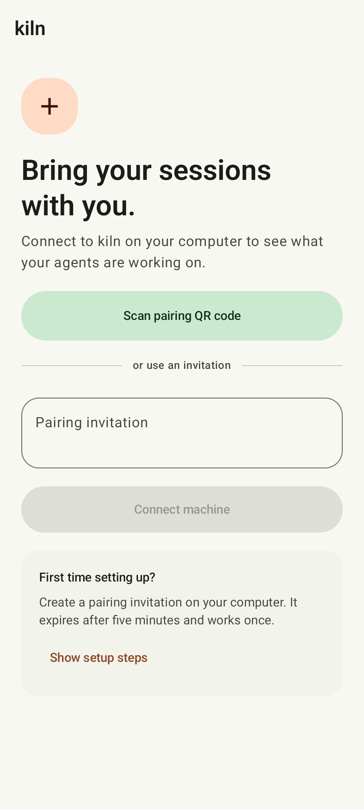
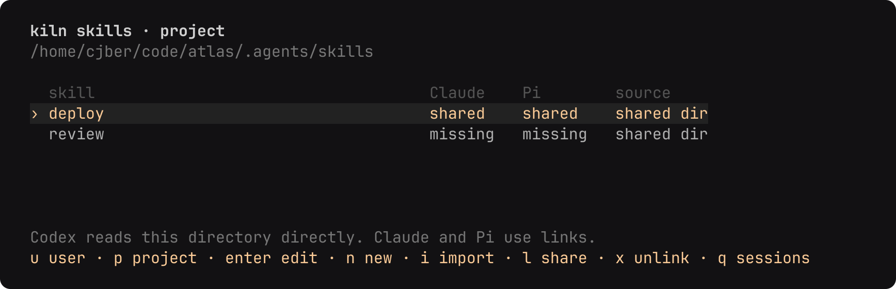

<div align="center">
  
  <h1>kiln</h1>

  **Coding-agent tasks, in one compact list.**

  [](https://github.com/cjber/kiln/actions/workflows/ci.yml)
  [](https://aur.archlinux.org/packages/kiln-agents)
  [](LICENSE)
</div>


kiln lists every interactive Claude Code, Codex and Pi session on the machine, wherever you started
it, and takes you to the one you pick. The keys are vim's, there is no tmux prefix to learn, and one
key brings you back to the list while the agent keeps working.

The terminal session list and shared skills view have no chat pane or daemon of their own.
The optional Android client uses `kiln serve` to read the same list over an authenticated stream.

## Install

On Arch, from the AUR:

```sh
paru -S kiln-agents     # source package, requires Bun
paru -S kiln-agents-bin # compiled binary, no Bun dependency
```

From source, with [Bun](https://bun.sh), [tmux](https://github.com/tmux/tmux) and
[fzf](https://github.com/junegunn/fzf) installed:

```sh
git clone https://github.com/cjber/kiln.git
cd kiln
bun install
ln -sf "$PWD/bin/kiln" ~/.local/bin/kiln
```

[zoxide](https://github.com/ajeetdsouza/zoxide) is optional and ranks the directories offered for a
new session. kiln runs on Linux: it reads `/proc` to find agents and their working directories.

Assigned titles come from Codex thread metadata and Claude transcript title records. Pi titles
come from the opt-in remote extension, `--name` or an explicitly selected JSONL session.
The extension identifies automatic sessions and follows their live names. Missing titles show the session ID or process ID.

## Keys

The list is normal mode. Filtering is the only mode that takes text, and Esc leaves it.

| Key | Action |
| --- | --- |
| `j` `k`, `g` `G`, `Ctrl+D` `Ctrl+U` | Move |
| `Enter` | Open the selected session |
| `n` | New session: pick an agent with `h` `l`, then a directory in fzf |
| `x` | Close the selected session, or archive a Codex background thread (`y` confirms) |
| `/` | Filter by agent, directory, branch or status |
| `s` | Edit settings in `$EDITOR`; they reload when you close it |
| `o` | Cycle last activity, age, harness, directory and project order |
| `Tab`, `←`, `→` | Expand or collapse the selected session’s children |
| `S` | Manage shared skills for this user or the selected session's project |
| `r` | Refresh now (the list refreshes every two seconds anyway) |
| `q` | Quit |


The directory picker is fzf over zoxide's ranking. Type any path that isn't in the list and Enter
opens it anyway.

## Where Enter goes

- **Started by kiln:** the agent runs in kiln's own tmux server (`tmux -L kiln`, set up by
  [`tmux.conf`](tmux.conf)). It has no prefix and one binding: `Ctrl+Q` goes back to the list and
  leaves the agent running. Esc stays with the agent, where it interrupts a turn. A one-line bar at
  the bottom names the session and counts the rest, e.g. `2 working · 1 waiting · 3 idle`.
- **In a kitty window:** kiln focuses that window. This needs `allow_remote_control yes` and
  `listen_on unix:@kitty` in `kitty.conf`.
- **In the background** (`bg`): a Claude session started with `claude --bg` or from agent view, or
  a Codex thread on its shared daemon with no terminal open (`codex agents`). kiln opens it with
  `claude attach` or `codex resume --remote` inside its own tmux, so `Ctrl+Q` works the same.
- **Codex Cloud** (`cloud`): read-only task rows. Enter shows `codex cloud status` and
  `codex cloud diff` in tmux. Press Enter to return, or `Ctrl+Q` to detach. Tasks cannot be
  closed here. Task titles identify the rows and elapsed time follows the last update.
  Pending tasks are working, ready or failed tasks are waiting, and applied tasks are idle.
  Tasks refresh at most once a minute; a failed refresh keeps the last rows and shows a notice.
  Provider task URLs are validated before they can be handed to a phone.
  Claude cloud discovery is unavailable in the CLI.
- **Anywhere else** (another multiplexer, an SSH session): hidden unless the session has a visible parent.

Unopenable children appear grey beneath their parent. Press `Tab` to reveal them. Provider child
threads use the reported parent-thread relationship, even when they have no terminal process.


`x` archives Codex background threads through their daemon, keeping history and hiding archived
threads from the list, including threads archived elsewhere. Codex may also archive descendant
threads. This action does not promise to stop active work. Use `codex unarchive <id>` to restore history.
For Claude background jobs, `x` stops the job and keeps its conversation. For kiln, kitty and other
terminal sessions of any agent, it closes the tmux session or terminates the agent process. Unsupported
actions explain why immediately, without asking for confirmation. Cloud tasks remain read-only.



Local directories refresh with the list: Claude and Pi use their live process working directory,
and a matched Codex daemon thread supplies its current session directory. The branch is read from
that directory on every refresh, including linked worktrees. A temporary `cd` inside a tool command
does not change the session directory. Cloud rows show task titles rather than a local checkout.

## Status

`working` is mid-turn, `waiting` has stopped to ask you something, and `idle` is ready for your next
message. Claude reports its own status through `claude agents --json`, and Codex through its daemon.
Pi reports working or idle through its opt-in extension. Without it, Pi status remains `unknown`.
Other unavailable statuses also show `unknown`. Codex threads match by confirmed
thread ID, which deduplicates attached terminals. Unidentified clients defer to known daemon tasks;
when daemon inventory is unavailable they remain visible with `unknown` status. Unmatched daemon
threads stay available as background tasks. Shared directories never establish thread ownership.
Remote Control servers run by a systemd service are left out.

While kiln is running, it sends a native desktop notification when an observed working turn
reaches `idle`, including while you are attached to a session. Approval pauses, quiet output and
sessions already idle when kiln opens do not trigger notifications. This requires `notify-send`
(Arch: `libnotify`) and a desktop notification service. Pi and older Codex sessions without a
reported idle status cannot confirm completion; cloud tasks are excluded.

The default view shows task titles, status and time since the last provider or transcript update, with seconds shown under one minute. Unassigned Codex launch screens and exited Claude processes are omitted. Unavailable timestamps show `unknown`. Status comes from the agent itself; terminal output does not imply that an agent is working. The list defaults to directory/task groups ordered by name, with the most recently updated sessions first in each group. Titles use the session name or Codex thread preview when available, otherwise the session ID. Unopenable sessions are hidden unless they have a visible parent. Children are collapsed by default; press `Tab` to expand them. Filtering also searches titles and reveals matching children with their parents. Set `sort` to `last_active`, `age` (oldest first), `harness`, `directory` (full path) or `project` (directory basename). Press `o` to cycle the order for this run, keeping the selected session and children beneath their parent. Codex Cloud uses its last update for both age and activity because its listing provides no creation time.

## Settings

`s` opens `~/.config/kiln/config.toml` (under `$XDG_CONFIG_HOME` if set), creating it with every
option at its default. An unknown key is an error, never silently ignored.

```toml
sort = "project"
detach_key = "C-q"   # back to the list, in tmux key syntax
status_bar = true    # the one-line bar inside an attached session
zoxide = true        # rank new-session directories with zoxide
cloud = true        # list read-only Codex Cloud tasks
notifications = true # native desktop notifications when turns finish
claude_cloud = false # opt into Claude's internal cloud-listing API; requires cloud = true
remote_control = true  # new Claude and Codex sessions can be driven from their phone apps

[agents]             # the command each agent starts with; [] hides it from `n`
claude = ["claude"]
codex = ["codex"]
pi = ["pi"]
```

With `remote_control` on, kiln starts Claude with `--remote-control` and makes sure Codex's daemon
is running with remote control (`codex remote-control start`) before starting Codex on it.
Pi remote control is enabled separately with `kiln pi install`.

Codex only uses its shared daemon when the command has no `-c`, `--enable`, `--disable` or `--search`
flag. Put those in `~/.codex/config.toml` instead (`web_search = "live"` for search), or the session
gets neither remote control nor a real status.

Run `kiln pi install` to enable the bundled extension for future interactive Pi sessions, then
restart Pi. Existing sessions cannot load it remotely. Kiln refreshes an installed extension when
its TUI opens; edited managed copies are backed up. It leaves unrelated extensions intact.

The [Pi bridge](extensions/README.md) exposes a private owner-only socket, never a network port.
Paired phones can read the last 40 text messages, send a prompt while idle and stop a turn. One phone
holds a writer lease, which expires 30 seconds after it stops reading. Reconnect reads a fresh
snapshot with an instance ID and sequence rather than replaying commands. Dialogs still require
the local terminal. Image payloads and older transcript messages are omitted.



## Claude cloud listing

Set `claude_cloud = true` to include Claude cloud sessions alongside Codex tasks. This uses the
internal listing API used by Claude Code 2.1.285's cloud picker, not a public Claude Code API.
It reads the existing Claude login from `~/.claude/.credentials.json`, or `$CLAUDE_CONFIG_DIR`,
and sends it only to `api.anthropic.com`. API-key logins do not provide these sessions. Expired
credentials need a running Claude CLI to refresh them, or `claude auth login`.

Bridge sessions already running locally and archived sessions are excluded. Listing runs in the
background at most once a minute with a ten-second deadline. Failures retain the last rows and
show a notice. Unknown worker states display `·`. Enter opens the selected session on claude.ai
using `xdg-open`; it does not teleport or change a local branch. `x` cannot close cloud sessions.
Both sources keep their last successful rows on a network or protocol fault. Claude credentials
are reread on each refresh, so a login refreshed by the CLI is picked up automatically. Codex
diagnostics do not include raw CLI output; run `codex cloud list` directly to inspect login faults.
`cloud = false` hides both providers. Long lists scroll with the selected row.

## Android

The native Android client lists sessions from one or more machines. It shows the same directory
groups, highlighted task titles, status and elapsed update times on a black OLED theme with muted
oxide accents. Harness and branch remain in task details. Pi tasks stay visible; those with the remote extension have an Open button.
It supports filtering and the same sort choices as the terminal list, and
hands Claude and Codex sessions to their apps (or a browser). It cannot
stop Claude or Codex sessions. Pi opens a kiln transcript with prompt and stop controls when its
remote extension is enabled. Local Codex sessions open the selected thread directly when the daemon reports a connected
Remote Control host. Older or disconnected daemons keep the manual ChatGPT handoff. Cloud tasks and Claude Remote Control sessions have
exact links when their provider reports one.

Install `kiln-android.apk` from a GitHub release for a consistently signed build. Debug APKs
from CI have temporary signing keys. Moving from a debug installation to a release build requires
a one-time reinstall and pairing again; later release updates preserve pairing data.

For development, build with JDK 21 and Android
SDK 36: `android/gradlew -p android assembleDebug`. The APK is at
`android/app/build/outputs/apk/debug/app-debug.apk`.

On the machine, run:

```sh
kiln serve
# In another terminal, expose only to your tailnet:
tailscale serve --bg --https=8443 http://127.0.0.1:7437
kiln pair https://YOUR-MACHINE.YOUR-TAILNET.ts.net:8443 --qr
```

The phone needs Tailscale connected to the same tailnet. Paste the printed invitation into the
app and press Connect machine, or scan its QR. Codes expire after five minutes and
work once. The server listens only on localhost, honours the existing cloud settings and refreshes
local sessions every two seconds. Cloud discovery remains asynchronous and runs at most once a
minute. A failed refresh keeps the last list with an error and its last successful update time.
The app reconnects after a dropped connection and closes the stream while it is in the background.

The compact list has Live, History and Hidden views. Live includes local sessions and cloud tasks
that are working, waiting or updated within 24 hours; older cloud tasks appear in History.
Tap a row to open it, or its information icon for details. Search, agent/activity filters and sort
choices are in the toolbar. Swipe left to hide a session on this phone, then use Undo or restore
it from Hidden. Hiding also hides its subagents, is saved per machine and never stops or archives
the provider session. The machine menu lets you switch, reconnect, pair or forget machines.




`kiln devices` lists paired phones; `kiln revoke DEVICE-ID` disconnects one and rejects its future
requests. Forget in the app removes its saved credential locally; revoke it on the machine too.
Credentials are encrypted using Android Keystore, excluded from backups and never included in
provider links. The server stores only credential hashes in
`~/.local/state/kiln/devices.sqlite` (or `$XDG_STATE_HOME/kiln/devices.sqlite`), with user-only file
permissions. Stop `kiln serve` to stop sharing; remove this Tailscale endpoint with
`tailscale serve --https=8443 off`. Do not use Tailscale Funnel for this private list.

## Shared skills

`S` opens the skills view. `u` selects `~/.agents/skills`, which applies to this user across
projects on this machine. `p` selects `.agents/skills` at the selected session's git root, or its
working directory when it is outside git. These are the canonical directories for all three agents.

`n` creates a skill and opens `SKILL.md` in `$EDITOR`. `Enter` edits an existing skill. `i` copies
an existing skill directory, including supporting files, into the selected scope. `l` shares it:
Codex reads the shared directory directly; Claude and Pi use relative compatibility links in their
own discovery directories. Existing entries that point somewhere else are marked `conflict` and
stay untouched when sharing. Green means shared, purple means missing and amber means conflict.
`f`, then `y`, repairs the selected skill: it backs up conflicting entries under
`.agents/skills/.kiln-backups` before linking the shared version. `x`, then `y`, removes only those
Claude and Pi links. It keeps the shared
files and Codex access. `q` returns to sessions.

Project skills stay in their project; importing them into the user scope is an explicit action.
kiln does not migrate existing harness folders automatically. A `link` in the source column means
the shared entry still points to files elsewhere. Plugin, synced and built-in skills remain managed
by their harness. Reload skills or restart existing sessions after changing the links.

kiln bundles `kiln-skills` for agents repairing shared skills and `kiln-config` for configuring kiln.
Opening the TUI keeps these user skills and their compatibility links in sync with the installed
version. Edited bundled instructions are backed up before updating; unrelated skills with the same
names are preserved and reported. Run `kiln skills sync` to update them without opening the TUI.

Agents can inspect `kiln skills list [--project DIR]`, create missing links with
`kiln skills share NAME [--project DIR]`, or repair conflicts explicitly with
`kiln skills share NAME [--project DIR] --backup-conflicts`. Repair prints the backup paths and keeps links to external supporting files readable.



## Development

CI builds and runs the standalone binary on native Linux x64 and arm64 runners. It checks the
TUI, embedded tmux configuration, attach/detach and the status bar's executable path. An Arch
container builds and installs the rendered binary PKGBUILD without Bun and checks its metadata,
checksums and TUI. The release job runs the same checks before publishing either executable.

```sh
bun install --frozen-lockfile
bunx biome ci .                           # format and lint; `bunx biome check --write .` fixes
bunx tsc --noEmit -p .
bun test
bun scripts/changelog.ts --check
python3 .sift/gate.py --base origin/main   # project rules (see .agents/skills/sift-project)
python3 .sift/agents.py check
bun scripts/screenshots.tsx 2>/dev/null   # seeded terminal screenshots
python3 scripts/icons.py                 # shared SVG to README and launcher icon
ANDROID_HOME=/path/to/sdk JAVA_HOME=/path/to/jdk21 python3 scripts/android-screenshots.py
```

Screenshots use seeded data and production UI. The Android script uses its own `kiln-screenshots`
AVD on port 5560, refuses another emulator on that port, and never selects a physical phone.
Install the API 35 Google APIs x86_64 system image and `rsvg-convert` to regenerate the assets.
Update both terminal and mobile screenshots after visible changes.

Build standalone Linux x64 and arm64 executables with:

```sh
bun install --frozen-lockfile --os linux --cpu "*"
bun scripts/build.ts
```

The files in `dist/` include OpenTUI's native library and the tmux configuration. They still
need tmux and fzf. Release assets can also be installed directly as `kiln` on your PATH.

Prepare a release with `bun scripts/release.ts patch` (or `minor`, `major`) on a separate PR
branch. It updates desktop and Android versions, moves the unreleased notes and makes a signed
commit. Run the full gate, open the PR and merge after CI passes. From a clean worktree at the
merged origin/main commit, run `bun scripts/release.ts tag`, run the full gate again and push only
the version tag. The tag publishes the Linux binaries, signed Android APK and both AUR packages.

## Changelog

What changed in each release is in [CHANGELOG.md](CHANGELOG.md).

## Licence

MIT. kiln started as a fork of [agent-deck](https://github.com/asheshgoplani/agent-deck) by Ashesh
Goplani and has since been rewritten down to this list; the original copyright notice is kept in
[LICENSE](LICENSE).

Made by Cillian Berragan · [GitHub](https://github.com/cjber)
