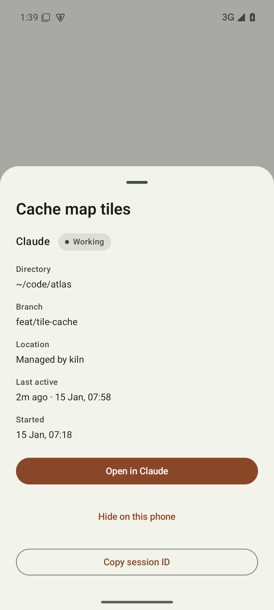

<p align="center"></p>

# kiln

kiln opens native Claude, Codex and Pi terminal sessions and pairs with an Android client. Kiln also lists read-only Codex Cloud tasks and optional Claude cloud sessions.

Claude and Codex keep their own TUIs for messages, prompts and approvals. Kiln discovers native sessions and reads provider status updates without starting a second agent. Terminal output never establishes activity.


## Install

```sh
paru -S kiln-agents-bin # standalone binary
# or: paru -S kiln-agents # Bun source package
```

From source, install [Bun](https://bun.sh), fzf and tmux, then:

```sh
bun install --frozen-lockfile
bun start
```

Install Claude Code, Codex CLI or Pi, and sign in through each provider's own CLI. Native commands and their arguments can be overridden in settings.

## Terminal

| Key | Action |
| --- | --- |
| `j` `k`, arrows | Select a session |
| `Enter` | Open a session or cloud task |
| `n` | Choose an agent, then a directory through fzf |
| `/` | Filter titles, directories, agent names and status |
| `Tab` | Expand children |
| `o` | Cycle list order |
| `x` | Close a kiln-owned session after confirmation |
| `s` | Edit settings |
| `S` | Open shared skills |
| `r` | Refresh |
| `q` | Quit the list |

Directory headings are orange. Sessions needing permission are yellow, ready sessions are muted green, and working sessions use subdued text. The header counts input requests even when children are collapsed. Open a yellow session to answer in the provider TUI.

New sessions run inside kiln's private tmux server. `Ctrl+Q` returns to the list and leaves the session running. Existing Kitty sessions can be focused; loaded Codex daemon threads and Claude background sessions can be attached through their native commands. Sessions in other terminals show their location.

Sessions running in a terminal survive a restart of the computer. They stay in the list as `stopped`: `Enter` resumes the conversation in a new kiln session in the same directory, and `x` forgets the row and leaves the conversation with its provider. A session closed before the restart is not kept, and neither is one without a provider session id, such as a Pi started outside kiln.

Finished Claude background jobs stay in the list, marked `completed` in green or `stopped` in grey. `Enter` attaches with `claude attach`. `x` deletes a background job, running or finished, with `claude rm`, which also removes its worktree and refuses while that worktree has unpushed commits.

Kiln observes each provider's own status and never guesses from terminal output, so unknown activity stays unknown. Kiln starts Pi with a small extension that reports the session's title and whether it is working, waiting on a prompt or ready. A Pi started outside kiln is listed with `unknown` status.

Desktop notifications identify the session when it needs input or finishes an observed turn. Enable `notify-send` and a desktop notification service to receive them.

Cloud tasks retain their provider status and verified HTTPS links. Claude cloud tasks open in a browser. Codex Cloud tasks open a read-only CLI status/diff viewer. Cloud tasks cannot be closed or prompted from kiln.

## Settings

Press `s` to edit `~/.config/kiln/config.toml` (`$XDG_CONFIG_HOME` when set). Unknown keys are errors. Each agent command launches that agent's native TUI.

```toml
sort = "project"
detach_key = "C-q"
status_bar = true
zoxide = true
cloud = true
notifications = true
claude_cloud = false
remote_control = true

[agents]
claude = ["claude"]
codex = ["codex"]
pi = ["pi"]
```

Set an agent command to `[]` to hide it from the new-session picker. `detach_key` and `status_bar` apply to native sessions and the Codex Cloud viewer. `remote_control` enables Claude Remote Control per new session and starts Codex Remote Control on its shared daemon.

`sort` accepts `project`, `directory`, `last_active`, `age` and `harness`. Directories are grouped by name and sessions by their most recent provider update. Branches are reread from the session directory on refresh.

Claude cloud listing is opt-in because it uses Claude's internal API. It reads an existing OAuth login and never accepts arbitrary API origins. Cloud reads are cached and refreshed asynchronously at most once per minute; provider failures retain the last successful list and show an error.

## Android

 

Install the APK from the repository's releases. To get updates on the phone, add `https://github.com/cjber/kiln` to [Obtainium](https://obtainium.imranr.dev); each release carries the same signing key. The phone lists native sessions and cloud tasks. Opening a linked session uses the provider's installed app or browser through verified HTTPS links. Claude Remote Control and connected Codex Remote Control provide direct session links. Sessions without mobile access explain how to open them on the PC.

```sh
kiln setup # installs a user service that survives reboots, configures Tailscale Serve and prints a pairing QR
# In the foreground instead, until the terminal closes:
kiln serve
# With your own HTTPS tunnel instead:
kiln serve --origin https://your-machine.example
# Localhost only, without tunnel setup or pairing:
kiln serve --local
# Generate another invitation while the server is running:
kiln pair https://your-machine.example --qr
kiln devices
kiln revoke <device-id>
```

Sign in to Tailscale before running `kiln serve`. An existing HTTPS root serving another application is preserved; use `--origin` with a separate tunnel in that case. Keep the server running while using the phone.

`kiln setup` writes `~/.config/systemd/user/kiln-serve.service`, enables it and reports each change; running it again changes nothing. A unit that is a symlink, for example into a dotfiles repository, is left alone and reported. The service listens on localhost only and never prints a pairing code to the journal. It records the current `PATH` so the agents' CLIs are found; run `kiln setup` again after moving them. To start before login, run `loginctl enable-linger`. `--port` and `--origin` work as they do for `kiln serve`.

On the phone, finished Claude background jobs show as Completed or Stopped and move to History after a day.

Pairing invitations expire after five minutes and work once. The phone stores its bearer token privately. The server binds to localhost, rejects browser requests and checks pairing for each request and streamed update. Keep the tunnel origin HTTPS. Revocation disconnects the phone without affecting agent sessions.

The list supports search, ordering, activity/agent filters, collapsed children and hiding sessions on that phone. Hidden rows can be restored. Saved machine connections survive upgrades.

## Shared skills

Press `S` in a selected project to manage shared skills. `n` creates a skill and opens `SKILL.md` in `$EDITOR`; `Enter` edits it. Conflicting content is backed up before repair. Kiln does not overwrite unowned same-name skills.

```sh
kiln skills list
kiln skills share <name>
kiln skills sync
```

The bundled `kiln-config` and `kiln-skills` helpers are synced into the shared store before the terminal starts.

## Verification

```sh
bunx biome ci .
bunx tsc --noEmit -p .
bun test
bun scripts/changelog.ts --check
python3 .sift/gate.py --base origin/main
python3 .sift/agents.py check
bun scripts/list-tui-e2e.ts
bun scripts/perf.ts
bun scripts/native-tui-e2e.ts
```

The PTY tests use [Tuistory](https://github.com/remorses/tuistory) against OpenTUI, with isolated fixtures and screenshot evidence. Native handoff tests exercise direct terminal input, detach, reattach and resizing.

After visible changes, regenerate and inspect terminal and dedicated-emulator screenshots:

```sh
bun scripts/screenshots.tsx 2>/dev/null
ANDROID_HOME=/opt/android-sdk JAVA_HOME=/usr/lib/jvm/java-21-openjdk python3 scripts/android-screenshots.py
ANDROID_HOME=/opt/android-sdk JAVA_HOME=/usr/lib/jvm/java-21-openjdk android/gradlew -p android checkKotlinFormat testDebugUnitTest lintDebug assembleDebug
```
