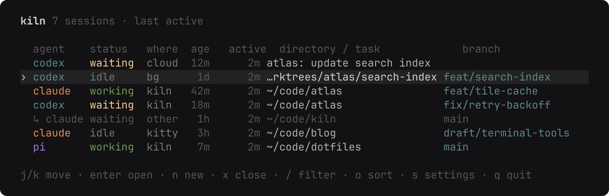
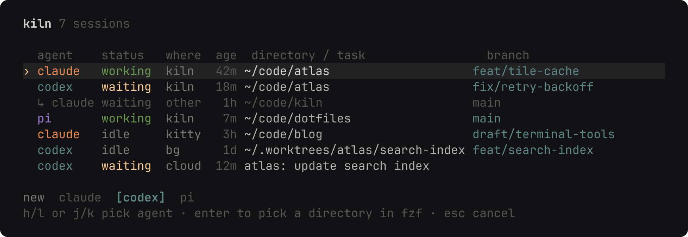
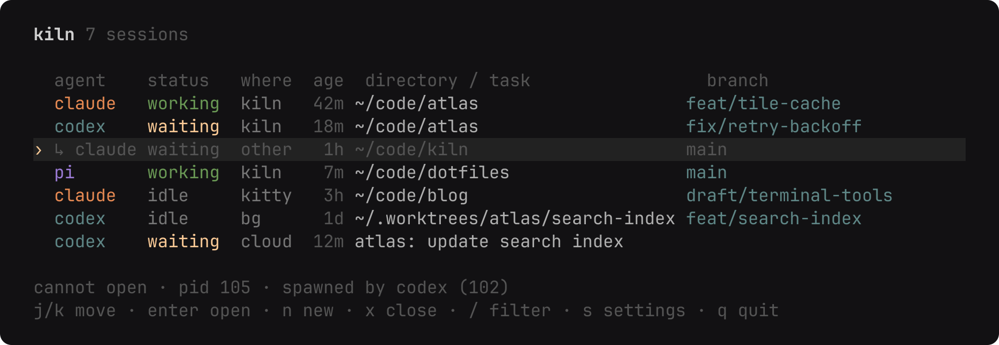

<div align="center">
  
  <h1>kiln</h1>

  **Every coding agent on this machine, in one list.**

  [](https://github.com/cjber/kiln/actions/workflows/ci.yml)
  [](https://aur.archlinux.org/packages/kiln-agents)
  [](LICENSE)
</div>



kiln lists every interactive Claude Code, Codex and Pi session on the machine, wherever you started
it, and takes you to the one you pick. The keys are vim's, there is no tmux prefix to learn, and one
key brings you back to the list while the agent keeps working.

It does one thing. There is no chat pane, no dashboard and no daemon of its own.

## Install

On Arch, from the AUR:

```sh
paru -S kiln-agents     # source package, requires Bun
paru -S kiln-agents-bin # compiled binary, no Bun dependency
```

From source, with [Bun](https://bun.sh), [tmux](https://github.com/tmux/tmux) and
[fzf](https://github.com/junegunn/fzf) installed:

```sh
git clone https://github.com/cjber/kiln.git
cd kiln
bun install
ln -sf "$PWD/bin/kiln" ~/.local/bin/kiln
```

[zoxide](https://github.com/ajeetdsouza/zoxide) is optional and ranks the directories offered for a
new session. kiln runs on Linux: it reads `/proc` to find agents and their working directories.

## Keys

The list is normal mode. Filtering is the only mode that takes text, and Esc leaves it.

| Key | Action |
| --- | --- |
| `j` `k`, `g` `G`, `Ctrl+D` `Ctrl+U` | Move |
| `Enter` | Open the selected session |
| `n` | New session: pick an agent with `h` `l`, then a directory in fzf |
| `x` | Close the selected session (`y` confirms) |
| `/` | Filter by agent, directory, branch or status |
| `s` | Edit settings in `$EDITOR`; they reload when you close it |
| `r` | Refresh now (the list refreshes every two seconds anyway) |
| `q` | Quit |



The directory picker is fzf over zoxide's ranking. Type any path that isn't in the list and Enter
opens it anyway.

## Where Enter goes

- **Started by kiln:** the agent runs in kiln's own tmux server (`tmux -L kiln`, set up by
  [`tmux.conf`](tmux.conf)). It has no prefix and one binding: `Ctrl+Q` goes back to the list and
  leaves the agent running. Esc stays with the agent, where it interrupts a turn. A one-line bar at
  the bottom names the session and counts the rest, e.g. `2 working · 1 waiting · 3 idle`.
- **In a kitty window:** kiln focuses that window. This needs `allow_remote_control yes` and
  `listen_on unix:@kitty` in `kitty.conf`.
- **In the background** (`bg`): a Claude session started with `claude --bg` or from agent view, or
  a Codex thread on its shared daemon with no terminal open (`codex agents`). kiln opens it with
  `claude attach` or `codex resume --remote` inside its own tmux, so `Ctrl+Q` works the same.
- **Codex Cloud** (`cloud`): read-only task rows. Enter shows `codex cloud status` and
  `codex cloud diff` in tmux. Press Enter to return, or `Ctrl+Q` to detach. Tasks cannot be
  closed here. The age is time since the last update, and the directory column shows the task
  title. Pending tasks are working, ready or failed tasks are waiting, and applied tasks are idle.
  Tasks refresh at most once a minute; a failed refresh keeps the last rows and shows a notice.
  Claude cloud discovery is unavailable in the CLI.
- **Anywhere else** (another multiplexer, an SSH session): listed, but there is nothing to attach to.

Sessions outside kiln and kitty appear grey because kiln cannot open them. Select one to see its
PID, terminal and originating agent or parent process when available. When that agent is a known
kiln session, the child appears beneath it with a small arrow.



## Status

`working` is mid-turn, `waiting` has stopped to ask you something, and `idle` is ready for your next
message. Claude reports its own status through `claude agents --json`, and Codex through its daemon.
Recent pane output counts as `working` when no agent status is available. Silence shows `·`, since
a quiet tool may still be running. Codex threads are matched by their local thread ID when available;
ambiguous directory matches show `·` rather than borrowing another session's status. Unmatched daemon
threads stay available as `bg` rows. Remote Control
servers run by a systemd service and Codex daemon sub-threads are left out.

## Settings

`s` opens `~/.config/kiln/config.toml` (under `$XDG_CONFIG_HOME` if set), creating it with every
option at its default. An unknown key is an error, never silently ignored.

```toml
detach_key = "C-q"   # back to the list, in tmux key syntax
status_bar = true    # the one-line bar inside an attached session
zoxide = true        # rank new-session directories with zoxide
cloud = true        # list read-only Codex Cloud tasks
remote_control = true  # new Claude and Codex sessions can be driven from their phone apps

[agents]             # the command each agent starts with; [] hides it from `n`
claude = ["claude"]
codex = ["codex"]
pi = ["pi"]
```

With `remote_control` on, kiln starts Claude with `--remote-control` and makes sure Codex's daemon
is running with remote control (`codex remote-control start`) before starting Codex on it. Pi has no
remote control, so it is unaffected.

Codex only uses its shared daemon when the command has no `-c`, `--enable`, `--disable` or `--search`
flag. Put those in `~/.codex/config.toml` instead (`web_search = "live"` for search), or the session
gets neither remote control nor a real status.

An opt-in [Pi remote control prototype](prototypes/README.md) exposes an existing interactive
session through a private local socket. It is not installed or enabled by kiln.

## Development

CI builds and runs the standalone binary on native Linux x64 and arm64 runners. It checks the
TUI, embedded tmux configuration, attach/detach and the status bar's executable path. An Arch
container builds and installs the rendered binary PKGBUILD without Bun and checks its metadata,
checksums and TUI. The release job runs the same checks before publishing either executable.

```sh
bun install --frozen-lockfile
bunx biome ci .                           # format and lint; `bunx biome check --write .` fixes
bunx tsc --noEmit -p .
bun test
bun scripts/changelog.ts --check
python3 .sift/gate.py --base origin/main   # project rules (see .agents/skills/sift-project)
python3 .sift/agents.py check
bun scripts/screenshots.tsx 2>/dev/null   # re-render assets/*.png from the real UI
```

Build standalone Linux x64 and arm64 executables with:

```sh
bun install --frozen-lockfile --os linux --cpu "*"
bun scripts/build.ts
```

The files in `dist/` include OpenTUI's native library and the tmux configuration. They still
need tmux and fzf. Release assets can also be installed directly as `kiln` on your PATH.

A release is `bun scripts/release.ts patch` (or `minor`, `major`) on `main`. It turns the
`[Unreleased]` entry in [CHANGELOG.md](CHANGELOG.md) into the new version's, then makes a signed
commit and tag. Pushing the tag publishes the GitHub release, with that entry as its notes, and the
source and binary AUR packages.

## Changelog

What changed in each release is in [CHANGELOG.md](CHANGELOG.md).

## Licence

MIT. kiln started as a fork of [agent-deck](https://github.com/asheshgoplani/agent-deck) by Ashesh
Goplani and has since been rewritten down to this list; the original copyright notice is kept in
[LICENSE](LICENSE).

Made by Cillian Berragan · [GitHub](https://github.com/cjber)
